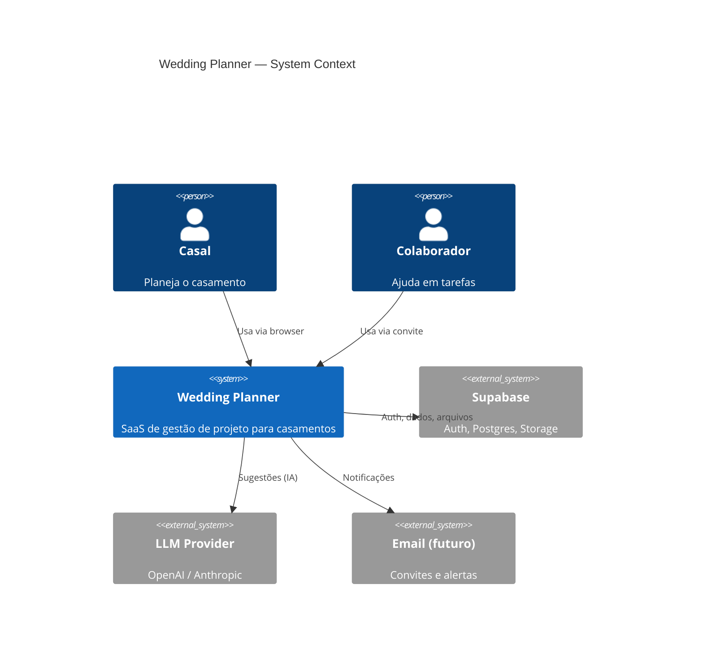
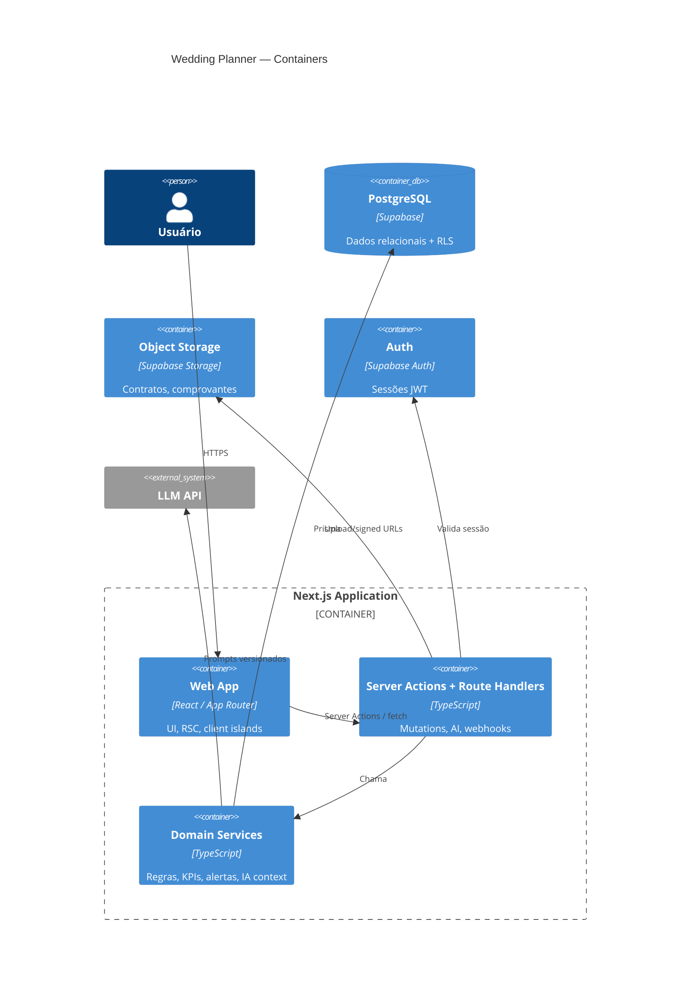
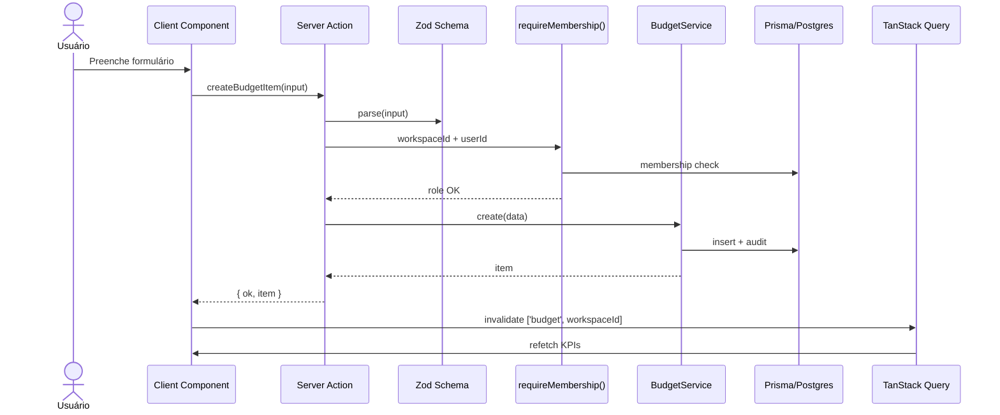
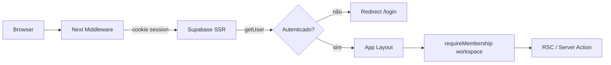
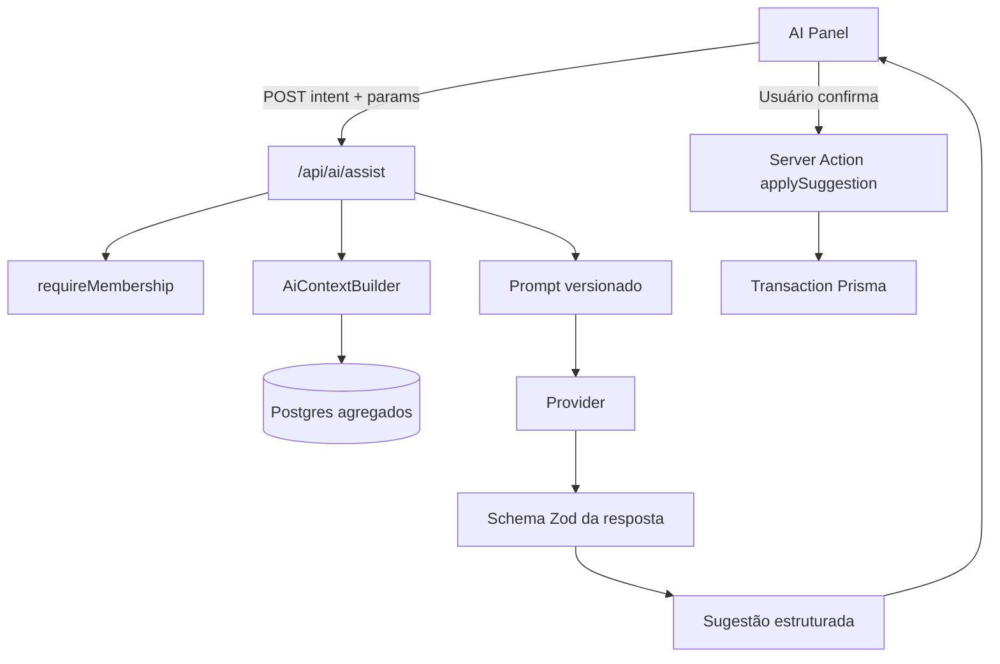
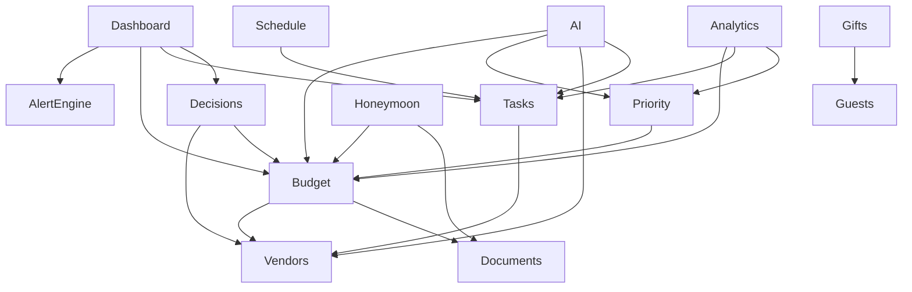

# Wedding Planner — Arquitetura de Software

**Versão:** 1.0  
**Status:** Aprovado — modelagem em andamento  
**Data:** 06 de agosto de 2026  
**Base:** [PRD 1.0](./01-PRD.md)  
**Estágio:** Etapa 2 de 9  

---

## 1. Decisões de Arquitetura (ADRs resumidos)

| ID | Decisão | Motivo |
|----|---------|--------|
| ADR-01 | Next.js 15 App Router (fullstack) | SSR + Server Actions + um só deploy; stack pedida |
| ADR-02 | Multi-tenant por `workspace_id` | MVP = 1 wedding/workspace; escala para agency |
| ADR-03 | Prisma no servidor + Postgres Supabase | Tipagem forte, migrations, DX; Auth/Storage no Supabase |
| ADR-04 | Autorização em camada de app + RLS | Prisma usa connection pool; RLS = defesa + Storage/API |
| ADR-05 | Feature modules por domínio | Escalável; evita “god folder” de components |
| ADR-06 | TanStack Query no client | Cache, invalidação, optimistic UI em telas interativas |
| ADR-07 | Server Actions para mutações | Menos boilerplate de API REST; validação Zod no boundary |
| ADR-08 | IA via Route Handler + provider pluggable | Isola custo/timeout; nunca escreve sem confirmação |
| ADR-09 | Money em centavos (`Int`/`BigInt`) | Evita float; BRL display na UI |
| ADR-10 | Design System em `components/ui` + tokens | shadcn base; tokens próprios (luxo minimalista) |

---

## 2. Visão C4

### 2.1 Contexto



### 2.2 Containers



### 2.3 Fluxo de uma mutação (exemplo: criar item de orçamento)



---

## 3. Stack e Responsabilidades

| Camada | Tecnologia | Responsabilidade |
|--------|------------|------------------|
| UI | React 19, Tailwind, shadcn, Framer Motion | Layout, DS, animações |
| Forms | RHF + Zod | Validação client/server alinhada |
| Data fetching (client) | TanStack Query | Listas interativas, charts, optimistic |
| Data fetching (server) | RSC + Prisma | Dashboard inicial, SEO interno, shell |
| Mutations | Server Actions | CRUD tipado |
| AI / uploads assinados | Route Handlers (`/api/*`) | Streaming, timeouts longos |
| ORM | Prisma | Schema, migrations, queries |
| DB | PostgreSQL (Supabase) | Persistência |
| Auth | Supabase Auth + `@supabase/ssr` | Login, cookies, middleware |
| Files | Supabase Storage | PDFs, imagens |
| Charts | Recharts | Orçamento / analytics |
| Icons | Lucide | Consistência visual |
| Hosting (alvo) | Vercel | Edge/Node conforme rota |

### 3.1 O que NÃO fica no client

- `DATABASE_URL` / Prisma Client  
- `SUPABASE_SERVICE_ROLE_KEY`  
- Chaves do LLM  
- Lógica de autorização (só UI gating cosmético)  

---

## 4. Multi-tenancy

### 4.1 Modelo

```
User ──< Membership >── Workspace ── 1:1 ── Wedding (MVP)
                              │
                              ├── BudgetItems
                              ├── Tasks
                              ├── Vendors
                              ├── Guests
                              ├── ...
```

- **Workspace** = contêiner de billing, membros e permissões.  
- **Wedding** = projeto de domínio (data, orçamento teto, estilo).  
- MVP: constraint “1 wedding ativo por workspace”.  
- Futuro agency: N weddings por workspace (ou N workspaces por agency org).

### 4.2 Isolamento

1. Toda tabela de domínio tem `workspace_id` (UUID, indexado).  
2. Toda query Prisma filtra por `workspace_id` obtido de `requireMembership`.  
3. RLS no Postgres: `workspace_id IN (SELECT workspace_id FROM memberships WHERE user_id = auth.uid())`.  
4. Storage paths: `{workspace_id}/{entity}/{file_id}`.  

### 4.3 Papéis

| Role | Código | Capacidade |
|------|--------|------------|
| Owner | `owner` | Tudo + transfer/delete |
| Partner | `partner` | CRUD total no wedding |
| Collaborator | `collaborator` | Tarefas + leitura (config) |
| Viewer | `viewer` | Read-only |

Enforcement: helper `assertPermission(role, action)` em services.

---

## 5. Autenticação e Sessão



### 5.1 Peças

| Peça | Função |
|------|--------|
| `middleware.ts` | Refresh session; protege `/app/*` |
| `lib/supabase/server.ts` | Client server (cookies) |
| `lib/supabase/client.ts` | Client browser |
| `lib/auth/session.ts` | `getCurrentUser()` |
| `lib/auth/membership.ts` | `requireMembership(workspaceId)` |
| Convites | Tabela `invitations` + token; edge case: email já cadastrado |

### 5.2 Segurança (Supabase)

- Nunca autorizar com `user_metadata` (editável pelo user).  
- Roles em `memberships` (tabela), não no JWT.  
- Service role só em server, nunca `NEXT_PUBLIC_`.  
- Storage: policies por path + membership.  
- JWT short-lived; sign-out invalida refresh.  

---

## 6. Camada de Domínio

### 6.1 Separação

| Camada | Contém | Não contém |
|--------|--------|------------|
| **UI (features)** | Pages, forms, tables, charts | SQL |
| **Actions / API** | Parse Zod, auth gate, call service | Regras de negócio longas |
| **Services** | CRUD + regras + KPIs + alertas | JSX |
| **Repos / Lib** | Prisma, Supabase, LLM client | Domínio de casamento |

### 6.2 Services principais (MVP)

| Service | Responsabilidade |
|---------|------------------|
| `WorkspaceService` | Create, invite, roles |
| `WeddingService` | Onboarding, settings |
| `BudgetService` | Items, totais, evolução |
| `PriorityMatrixService` | Sala de cortes, scoring |
| `TaskService` | Checklist, deps, phases |
| `VendorService` | Fornecedores |
| `GuestService` | Convidados + filtros |
| `GiftService` | Presentes |
| `HoneymoonService` | Sub-espaço lua de mel |
| `DocumentService` | Metadata + Storage |
| `ScheduleService` | Views sobre tasks/milestones |
| `DecisionService` | Central de decisões |
| `AnalyticsService` | Agregações |
| `AlertEngine` | Regras A1–A8 do PRD |
| `DashboardService` | Compõe KPIs |
| `AiAssistantService` | 5 intents + confirmação |
| `AuditService` | History de mudanças críticas |

### 6.3 Cálculos de KPI (fonte única)

`DashboardService` e `AnalyticsService` leem de funções puras em `modules/*/calculations.ts` — **mesma fórmula** no server e, se necessário, espelho tipado no client só para preview otimista.

Exemplos:

```
completionPct = doneTasks / totalTasks
remainingCash = wedding.totalBudget - sum(paid)
committed = sum(contracted || planned)
overBudget = committed > totalBudget
cutScore(item) = f(flexibility, 1/emotionalReturn, cost, priority)
```

---

## 7. Estratégia de Dados

### 7.1 Prisma + Supabase

| Concern | Abordagem |
|---------|-----------|
| Schema source of truth | `prisma/schema.prisma` |
| Migrations | Prisma Migrate → aplicadas no Postgres Supabase |
| Runtime queries | Prisma Client (Node runtime) |
| Connection | Pooler (Supavisor) `DATABASE_URL`; direct para migrate |
| Auth users | `auth.users` (Supabase); espelho `public.profiles` |
| Files | Storage; metadados em `documents` |

### 7.2 Por que não só Supabase Client no DB?

- Joins complexos, agregações de dashboard e transações (onboarding seed) são mais claros em Prisma.  
- Tipagem end-to-end com Zod + Prisma.  
- RLS continua ativo para Storage e como rede de segurança se alguém usar PostgREST.

### 7.3 Transações críticas

- Onboarding: criar workspace + wedding + memberships + seed checklist + seed categories — **uma transaction**.  
- Aceitar sugestão IA: apply batch de updates em transaction.  

### 7.4 Soft delete

Entidades principais: `deleted_at` nullable. Hard delete só em LGPD “delete account”.

### 7.5 Audit / history

- `activity_logs`: actor, entity, action, payload JSON, created_at.  
- Task comments: tabela própria.  
- Não versionar tudo no MVP — só mudanças de status/valor relevantes.

---

## 8. Estrutura de Pastas

Alinhada ao pedido do PRD (escalável, comercial):

```text
/
├── apps/web/                          # (ou raiz se monorepo single-app)
│   ├── app/                           # Next.js App Router
│   │   ├── (marketing)/               # landing futura
│   │   ├── (auth)/                    # login, signup, invite
│   │   ├── (onboarding)/              # fluxo inicial
│   │   ├── (app)/                     # shell autenticado
│   │   │   ├── layout.tsx
│   │   │   ├── dashboard/
│   │   │   ├── budget/
│   │   │   ├── priority/
│   │   │   ├── tasks/
│   │   │   ├── vendors/
│   │   │   ├── guests/
│   │   │   ├── gifts/
│   │   │   ├── honeymoon/
│   │   │   ├── documents/
│   │   │   ├── schedule/
│   │   │   ├── decisions/
│   │   │   ├── analytics/
│   │   │   ├── alerts/
│   │   │   ├── ai/
│   │   │   └── settings/
│   │   └── api/                       # Route Handlers (AI, signed upload)
│   ├── components/
│   │   ├── ui/                        # shadcn + primitives DS
│   │   ├── layout/                    # shell, nav, sidebar
│   │   └── shared/                    # empty state, KPI, page header
│   ├── features/                      # UI composta por domínio (hooks+components de tela)
│   │   ├── dashboard/
│   │   ├── budget/
│   │   ├── tasks/
│   │   └── ...
│   ├── modules/                       # domínio puro (services, calculations, rules)
│   │   ├── budget/
│   │   │   ├── service.ts
│   │   │   ├── calculations.ts
│   │   │   └── alert-rules.ts
│   │   ├── alerts/
│   │   ├── ai/
│   │   └── ...
│   ├── hooks/                         # hooks genéricos (useMediaQuery, useDebounce)
│   ├── services/                      # facades infra (opcional; prefer modules/)
│   ├── types/                         # tipos compartilhados de UI/domínio
│   ├── schemas/                       # Zod (source of truth de input)
│   ├── utils/                         # formatMoney, dates, cn()
│   ├── lib/
│   │   ├── prisma.ts
│   │   ├── supabase/
│   │   ├── auth/
│   │   ├── storage/
│   │   ├── ai/
│   │   └── constants/
│   ├── providers/                     # QueryClient, Theme, Toast
│   └── styles/                        # globals, tokens.css
├── prisma/
│   ├── schema.prisma
│   ├── migrations/
│   └── seed.ts
├── docs/
├── public/
└── package.json
```

### 8.1 Regra de dependência

```text
app → features → modules → lib
app → components
features → components / hooks / schemas
modules ↛ features  (nunca)
modules ↛ components
```

**Decisão:** no MVP usamos **single app na raiz** (`/app`, `/components`, …) para velocidade. A árvore acima é a organização lógica; monorepo `apps/web` fica como evolução se surgir agency API.

---

## 9. Frontend Architecture

### 9.1 Padrão de página

1. **RSC** carrega dados iniciais do módulo (Prisma).  
2. Passa para **Client Feature** quando há interação rica (tabela editável, kanban, charts).  
3. Client usa **TanStack Query** com `initialData` do RSC.  
4. Mutations via Server Actions → `queryClient.invalidateQueries`.  

### 9.2 Query keys

```ts
['workspace', workspaceId]
['dashboard', workspaceId]
['budget', workspaceId, filters]
['tasks', workspaceId, view]
['alerts', workspaceId]
```

### 9.3 UX shell

- Sidebar + top bar com: dias restantes, % concluído, badge de alertas.  
- Cada página: **PageHeader** (título + próximo passo sugerido) + conteúdo.  
- Empty states com CTA único.

### 9.4 Design System (posição na arquitetura)

- Tokens CSS variables em `styles/tokens.css`.  
- Primitives em `components/ui`.  
- Composições de produto (`KpiStat`, `PriorityBadge`, `MoneyCell`) em `components/shared`.  
- Detalhamento visual: Etapa 7.

---

## 10. Assistente de IA



### 10.1 Princípios

| Regra | Detalhe |
|-------|---------|
| Context mínimo | Totais, top items, gaps — não PII de convidados desnecessária |
| Output estruturado | JSON schema / Zod |
| Idempotência | `suggestion_id`; apply uma vez |
| Fallback | Se LLM falhar → `PriorityMatrixService.suggestCuts()` por regras |
| Custo | Rate limit por workspace; feature flag `ai_enabled` |

### 10.2 Intents (contratos)

```ts
type AiIntent =
  | 'budget_overflow'
  | 'what_to_hire'
  | 'generate_tasks'
  | 'vendor_value'
  | 'budget_allocation'
```

Cada intent tem: `inputSchema`, `outputSchema`, `buildContext()`, `fallback()`.

---

## 11. Storage de Arquivos

| Etapa | Fluxo |
|-------|-------|
| 1 | Client pede signed upload URL (`/api/storage/upload-url`) |
| 2 | Server valida membership + mime + size |
| 3 | Client faz PUT no Storage |
| 4 | Client confirma → `DocumentService.create` metadata |
| 5 | Download via signed URL (TTL curto) |

Limites MVP: 10 MB/arquivo; 1 GB/workspace (config).

Tipos: `application/pdf`, `image/jpeg`, `image/png`, `image/webp`.

---

## 12. Alert Engine

- Pure functions em `modules/alerts/rules.ts`.  
- Avaliado: on-read no Dashboard (MVP) + opcionalmente job cron futuro.  
- Output: `{ id, severity, title, entityRef, ctaHref }[]`.  
- Sem fila no MVP — compute síncrono com queries agregadas indexadas.

---

## 13. Observabilidade e Ambientes

| Ambiente | Uso |
|----------|-----|
| `local` | Docker Postgres ou Supabase local + `.env.local` |
| `staging` | Projeto Supabase staging + Vercel preview |
| `production` | Supabase prod + Vercel prod |

| Sinal | Ferramenta (MVP) |
|-------|------------------|
| Errors | Vercel logs + opcional Sentry |
| Product events | Console/structured log → PostHog futuro |
| Health | `/api/health` (db ping) |

Env vars (categorias):

```text
DATABASE_URL=
DIRECT_URL=
NEXT_PUBLIC_SUPABASE_URL=
NEXT_PUBLIC_SUPABASE_ANON_KEY=
SUPABASE_SERVICE_ROLE_KEY=
AI_PROVIDER=
AI_API_KEY=
NEXT_PUBLIC_APP_URL=
```

---

## 14. Performance

| Técnica | Onde |
|---------|------|
| RSC streaming | Dashboard shell |
| Parallel Prisma queries | `Promise.all` KPIs |
| Indexes | `workspace_id`, `due_date`, `status`, FKs |
| Select parcial | Evitar `include` profundo |
| Chart data | Agregado no server, não raw rows no client |
| Images | Next/Image só quando necessário |

Runtime: Node para rotas Prisma (não Edge).

---

## 15. LGPD e Compliance (arquitetural)

| Requisito | Mecanismo |
|-----------|-----------|
| Export | Job/action que serializa JSON do workspace |
| Delete account | Cascade soft → hard purge Storage + rows |
| Minimização IA | Context builder sem telefones/docs |
| Consentimento | Terms no signup (texto na Etapa 4) |

---

## 16. Evolução para milhares de casais

Preparações já na arquitetura MVP:

1. `workspace_id` em tudo + indexes  
2. Papéis e feature flags (`lib/flags.ts`)  
3. Services sem singleton de estado  
4. AI rate limit por tenant  
5. Separação `Workspace` vs `Wedding`  
6. Activity log para suporte  
7. Connection pooling  
8. Pasta `modules/` testável sem UI  

Não fazer agora: microserviços, CQRS, event bus, read replicas.

---

## 17. Test Strategy (mínimo comercial)

| Tipo | Escopo MVP |
|------|------------|
| Unit | `calculations.ts`, alert rules, cut score |
| Integration | Services com DB de teste |
| E2E smoke | Onboarding → criar budget → ver KPI (Playwright futuro) |
| Typecheck | `tsc` + Zod nos boundaries |

---

## 18. Diagrama de módulos (dependências)



---

## 19. Critérios de Aceite — Arquitetura

- [x] C4 contexto + containers definidos  
- [x] Multi-tenancy e papéis definidos  
- [x] Auth/sessão e regras de segurança Supabase  
- [x] Separação app / features / modules / lib  
- [x] Estratégia Prisma + Storage + AI  
- [x] Query/mutation pattern (RSC + TanStack + Actions)  
- [x] Caminho claro para agency/multi-wedding  

---

## 20. Próxima Etapa

**Etapa 3 — Modelagem do Banco**

Incluirá:

- Diagrama ER  
- `prisma/schema` completo (entidades, enums, indexes)  
- Políticas RLS (SQL)  
- Storage buckets  
- Seed de categorias e template de checklist  
- Notas de migração  

**Não iniciaremos fluxos de usuário, sitemap, wireframes, Design System nem implementação até a modelagem ser revisada.**

---

### Changelog

| Versão | Data | Mudança |
|--------|------|---------|
| 1.0 | 2026-08-06 | Arquitetura inicial completa |
