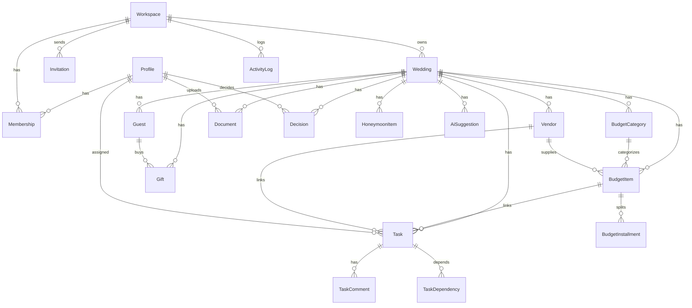
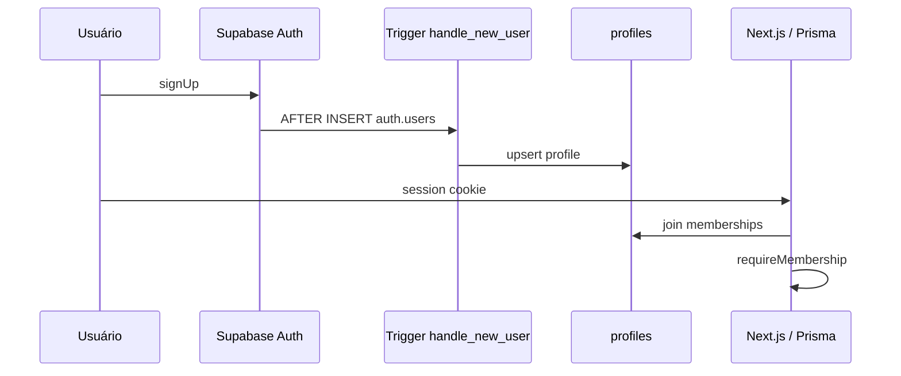

# Wedding Planner — Modelagem do Banco de Dados

**Versão:** 1.0  
**Status:** Aprovado — fluxos em andamento  
**Data:** 06 de agosto de 2026  
**Base:** [PRD](./01-PRD.md) · [Arquitetura](./02-ARCHITECTURE.md)  
**Artefatos:**

| Arquivo | Conteúdo |
|---------|----------|
| [`prisma/schema.prisma`](../prisma/schema.prisma) | Schema completo (source of truth) |
| [`docs/sql/rls-policies.sql`](./sql/rls-policies.sql) | RLS + trigger de profile |
| [`docs/sql/storage-policies.sql`](./sql/storage-policies.sql) | Bucket + policies Storage |

---

## 1. Decisões de modelagem

| ID | Decisão | Motivo |
|----|---------|--------|
| DB-01 | Money em `Int` (centavos) | Sem float; BRL até ~R$ 21M cabe em Int32 |
| DB-02 | `workspace_id` denormalizado nas tabelas quentes | Filtro de tenant sem join; indexes simples |
| DB-03 | `Wedding` 1:N preparado; MVP usa 1 ativo | Agency no futuro sem redesign |
| DB-04 | Prioridade/flexibilidade/emocional no `BudgetItem` | Matriz transversal sem tabela extra |
| DB-05 | Milestone = `Task.is_milestone` | Uma entidade para Kanban/Cal/Gantt |
| DB-06 | Documentos polimórficos (`linked_type` + `linked_id`) | Evita N tabelas de join no MVP |
| DB-07 | Categorias copiadas por wedding no onboarding | Customização sem quebrar seed global |
| DB-08 | Soft delete (`deleted_at`) nas entidades principais | Undo + LGPD controlado |
| DB-09 | `AiSuggestion` persistida antes do apply | Idempotência e auditoria |
| DB-10 | Profile espelha `auth.users` via trigger | FK estável sem tocar schema `auth` |

---

## 2. Diagrama ER (visão lógica)



### Hierarquia de tenancy

```text
User (auth.users)
  └── Profile
        └── Membership (role) ── Workspace
                                   └── Wedding (projeto)
                                         └── domínio (budget, tasks, …)
```

---

## 3. Catálogo de tabelas

### 3.1 Identity & tenancy

| Tabela | Papel |
|--------|-------|
| `profiles` | Espelho de `auth.users` |
| `workspaces` | Tenant / billing futuro |
| `memberships` | user ↔ workspace + role |
| `invitations` | Convite por email + token |

**Roles:** `owner` · `partner` · `collaborator` · `viewer`

### 3.2 Projeto

| Tabela | Papel |
|--------|-------|
| `weddings` | Casamento: data, teto orçamentário, estilo, status |

Campos-chave: `total_budget` (centavos), `wedding_date`, `style_tags[]`, `onboarding_done`.

### 3.3 Orçamento

| Tabela | Papel |
|--------|-------|
| `budget_categories` | Catálogo por wedding (+ seed system) |
| `budget_items` | Linha orçamentária + matriz de prioridade |
| `budget_installments` | Parcelas |

**Matriz no item:** `priority` (1–5), `flexibility`, `emotional_return` (1–5).

**Status:** `planned` → `quoted` → `contracted` → `partially_paid` → `paid` (| `cancelled`).

**Saldo:** calculado na aplicação — não persistido  
`balance = coalesce(contracted, planned) - paid`.

### 3.4 Fornecedores / Tarefas / Convidados / etc.

| Tabela | Papel |
|--------|-------|
| `vendors` | Fornecedores |
| `tasks` | Checklist + cronograma (+ milestones) |
| `task_dependencies` | Grafo de dependências |
| `task_comments` | Thread linear |
| `guests` | Lista de convidados |
| `gifts` | Presentes |
| `honeymoon_items` | Reservas/docs da lua de mel |
| `documents` | Metadados + path Storage |
| `decisions` | Central de decisões |
| `ai_suggestions` | Preview de IA |
| `activity_logs` | Auditoria |

---

## 4. Enums (resumo)

| Domínio | Valores |
|---------|---------|
| TaskPhase | `m18 m12 m9 m6 m3 m1 d15 d7 d3 day_of post honeymoon` |
| TaskStatus | `todo doing blocked done cancelled` |
| VendorStatus | `researching contacted quoted contracted rejected cancelled` |
| RsvpStatus | `pending yes no maybe` |
| GiftStatus | `available reserved purchased delivered` |
| DecisionStatus | `pending decided revisited` |
| DocumentType | `contract receipt invoice photo pdf other` |
| Flexibility | `cannot_cut can_reduce can_remove` |
| AiIntent | 5 intents do PRD |

---

## 5. Constraints e regras no banco

| Regra | Implementação |
|-------|----------------|
| Membership único | `@@unique([workspaceId, userId])` |
| Parcela única por sequência | `@@unique([budgetItemId, sequence])` |
| Dependência única | `@@unique([taskId, dependsOnTaskId])` |
| Priority / emotional | Validar no Zod (1–5); check SQL opcional na migration |
| Soft delete | Queries de app sempre `deleted_at IS NULL` |
| Cascade tenant | `onDelete: Cascade` workspace → wedding → filhos |
| Vendor removido | `budget_items.vendor_id` → `SetNull` |

### CHECK sugeridos (SQL pós-migrate)

```sql
ALTER TABLE budget_items
  ADD CONSTRAINT budget_items_priority_chk CHECK (priority BETWEEN 1 AND 5),
  ADD CONSTRAINT budget_items_emotional_chk CHECK (emotional_return BETWEEN 1 AND 5),
  ADD CONSTRAINT budget_items_amounts_chk CHECK (
    planned_amount >= 0 AND paid_amount >= 0
    AND (contracted_amount IS NULL OR contracted_amount >= 0)
  );

ALTER TABLE tasks
  ADD CONSTRAINT tasks_priority_chk CHECK (priority BETWEEN 1 AND 5);

ALTER TABLE vendors
  ADD CONSTRAINT vendors_rating_chk CHECK (rating IS NULL OR rating BETWEEN 1 AND 5);
```

### MVP: um wedding ativo por workspace

Enforced na **aplicação** no onboarding (`count(weddings where deleted_at is null) = 0`).  
Índice parcial futuro (agency remove a regra):

```sql
-- NÃO aplicar no agency mode
-- CREATE UNIQUE INDEX one_active_wedding_per_workspace
--   ON weddings (workspace_id) WHERE deleted_at IS NULL AND status <> 'archived';
```

---

## 6. Indexes (estratégia de query)

| Query típica | Index |
|--------------|-------|
| Dashboard por wedding | `budget_items(wedding_id, status)`, `tasks(wedding_id, status)` |
| Atrasados | `tasks(wedding_id, due_date)`, `budget_items(next_payment_date)` |
| Filtro convidados | `guests(wedding_id, rsvp)`, `(wedding_id, group_name)` |
| Tenant isolation | `workspace_id` em todas as tabelas quentes |
| Docs polimórficos | `(linked_type, linked_id)` |
| Activity feed | `(workspace_id, created_at)` |

---

## 7. Cálculos derivados (não persistidos)

| KPI | Fórmula |
|-----|---------|
| Previsto | `sum(planned_amount)` onde status ≠ cancelled |
| Contratado | `sum(contracted_amount)` |
| Pago | `sum(paid_amount)` |
| Restante caixa | `wedding.total_budget - pago` |
| Comprometido | `sum(coalesce(contracted, planned))` |
| % tarefas | `count(done) / count(active)` |
| Cut score | ver `PriorityMatrixService` (flexibilidade ↑, emocional ↓, custo ↑) |

---

## 8. Seed — Categorias de orçamento (BR)

Copiadas para o wedding no onboarding (`is_system` no template; cópias com `wedding_id`).

| slug | name | sort |
|------|------|------|
| venue | Local / Espaço | 10 |
| catering | Buffet / Catering | 20 |
| drinks | Bebidas | 30 |
| decoration | Decoração | 40 |
| flowers | Flores | 50 |
| photo_video | Foto e Vídeo | 60 |
| music | Música / DJ / Banda | 70 |
| attire | Trajes | 80 |
| beauty | Beleza | 90 |
| stationery | Papelaria / Convites | 100 |
| cake | Bolo e Doces | 110 |
| favors | Lembrancinhas | 120 |
| transport | Transporte | 130 |
| ceremony | Cerimônia | 140 |
| entertainment | Entretenimento | 150 |
| honeymoon | Lua de Mel | 160 |
| fees | Taxas e Gorjetas | 170 |
| contingency | Reserva / Contingência | 180 |
| other | Outros | 190 |

### Benchmark sugerido de alocação (IA / onboarding)

Usado pelo intent `budget_allocation` (ajustável por faixa):

| slug | % típico |
|------|----------|
| venue | 30 |
| catering | 20 |
| decoration | 10 |
| photo_video | 8 |
| music | 5 |
| attire | 7 |
| honeymoon | 8 |
| contingency | 5 |
| demais | restante |

---

## 9. Seed — Template de checklist (amostra)

~80–120 tarefas no seed completo (`prisma/seed.ts` na implementação).  
Amostra por fase:

| phase | title | priority | category |
|-------|-------|----------|----------|
| m18 | Definir orçamento total | 5 | other |
| m18 | Definir data e estilo | 5 | other |
| m12 | Fechar local da cerimônia/festa | 5 | venue |
| m12 | Pesquisar buffets | 4 | catering |
| m9 | Contratar fotógrafo | 5 | photo_video |
| m9 | Definir lista preliminar de convidados | 4 | other |
| m6 | Escolher trajes | 4 | attire |
| m6 | Contratar DJ/banda | 4 | music |
| m3 | Enviar convites | 5 | stationery |
| m3 | Degustação do buffet | 4 | catering |
| m1 | Confirmar RSVPs pendentes | 5 | other |
| m1 | Revisar pagamentos em aberto | 5 | other |
| d15 | Confirmar fornecedores | 5 | other |
| d7 | Entregar lista final de convidados ao buffet | 5 | catering |
| d3 | Montar kit emergência do dia | 3 | other |
| day_of | Seguir timeline do dia | 5 | other |
| post | Enviar agradecimentos | 3 | other |
| honeymoon | Emitir/passar portaporte | 5 | honeymoon |
| honeymoon | Contratar seguro viagem | 4 | honeymoon |

Cada seed gera `template_key` estável (ex.: `br.m12.lock_venue`) para não duplicar em re-seed.

---

## 10. Storage

| Item | Valor |
|------|-------|
| Bucket | `wedding-documents` (private) |
| Path | `{workspace_id}/{wedding_id}/{document_id}/{filename}` |
| Max file | 10 MB |
| MIME | pdf, jpeg, png, webp |
| Quota workspace | 1 GB (enforced na app somando `documents.size_bytes`) |

Metadados em `documents`; bytes no Storage. Soft delete marca DB; purge físico em job LGPD.

---

## 11. Fluxo de criação (onboarding — transaction)

```text
1. CREATE workspace
2. CREATE membership (owner)
3. CREATE wedding (drafting)
4. COPY budget_categories → wedding
5. INSERT tasks FROM template (due_date derivado de wedding_date + phase offset)
6. OPTIONAL invitation partner
7. SET onboarding_done = true, status = planning
8. ACTIVITY_LOG created
```

Offsets de fase (dias antes do casamento):

| phase | offset |
|-------|--------|
| m18 | 540 |
| m12 | 365 |
| m9 | 270 |
| m6 | 180 |
| m3 | 90 |
| m1 | 30 |
| d15 | 15 |
| d7 | 7 |
| d3 | 3 |
| day_of | 0 |
| post | -7 |
| honeymoon | configurável |

---

## 12. Ordem de migração

1. `prisma migrate` → cria tabelas/enums/indexes  
2. Aplicar CHECK constraints (`docs/sql` ou migration SQL raw)  
3. Aplicar [`rls-policies.sql`](./sql/rls-policies.sql)  
4. Aplicar [`storage-policies.sql`](./sql/storage-policies.sql)  
5. `prisma db seed` → categorias system + template tasks (globais em código)  
6. Smoke: signup → trigger profile → onboarding transaction  

### Connection strings

```text
DATABASE_URL=  # pooler (runtime Prisma)
DIRECT_URL=    # direct (migrate)
```

---

## 13. Relação com Auth Supabase



**Importante:** autorização de role **sempre** via `memberships`, nunca `user_metadata`.

---

## 14. Mapa módulo → tabelas

| Módulo UX | Tabelas |
|-----------|---------|
| Dashboard | agrega wedding, budget_items, tasks, vendors, decisions |
| Orçamento | budget_categories, budget_items, budget_installments |
| Matriz / Sala de cortes | budget_items (campos de matriz) |
| Checklist / Cronograma | tasks, task_dependencies, task_comments |
| Fornecedores | vendors |
| Convidados | guests |
| Presentes | gifts |
| Lua de mel | honeymoon_items + tasks(phase=honeymoon) |
| Documentos | documents + Storage |
| Decisões | decisions |
| Analytics | agregações read-only |
| IA | ai_suggestions |
| Settings / equipe | workspaces, memberships, invitations |

---

## 15. Evolução (sem quebrar MVP)

| Futuro | Como o schema aguenta |
|--------|------------------------|
| Multi-wedding / agency | Remover constraint app; N `weddings` |
| Org acima de workspace | Nova tabela `organizations` |
| RSVP público | Token em `guests` + API pública |
| Open Finance | `bank_transactions` ligadas a installments |
| Realtime collab | Supabase Realtime nas mesmas tabelas |

---

## 16. Critérios de aceite — Modelagem

- [x] ER cobre todos os módulos do PRD  
- [x] `schema.prisma` completo com indexes e soft delete  
- [x] RLS + Storage SQL documentados  
- [x] Seed de categorias e amostra de checklist  
- [x] Money, tenancy e matriz de prioridade explícitos  
- [x] Caminho de migração definido  

---

## 17. Próxima etapa

**Etapa 4 — Fluxos de usuário**

Incluirá:

- Fluxos principais (signup → onboarding → operação diária)  
- Fluxos por módulo  
- Estados vazios / erro / permissão  
- Happy path + edge cases  
- Mapa de permissões por role em cada fluxo  

**Não iniciaremos sitemap, wireframes, Design System nem código de app até os fluxos serem revisados.**

---

### Changelog

| Versão | Data | Mudança |
|--------|------|---------|
| 1.0 | 2026-08-06 | Modelagem inicial completa |
