# Wedding Planner — Fluxos de Usuário

**Versão:** 1.0  
**Status:** Aprovado — sitemap em andamento  
**Data:** 06 de agosto de 2026  
**Base:** [PRD](./01-PRD.md) · [Arquitetura](./02-ARCHITECTURE.md) · [Banco](./03-DATABASE.md)  

---

## 1. Princípios de fluxo

Cada jornada deve terminar com o usuário sabendo:

1. **O que acabou de acontecer** (feedback)
2. **Qual o próximo passo** (orientação)
3. **Qual o impacto** (custo, prazo ou risco — quando aplicável)

### Linguagem de estados

| Estado | Quando | UI |
|--------|--------|-----|
| Empty | Zero registros relevantes | CTA único + benefício |
| Loading | Fetch inicial | Skeleton (não spinner genérico em tela cheia) |
| Partial | Dados incompletos (ex.: sem data) | Banner + CTA corrigir |
| Ready | Dados suficientes | Conteúdo + próximo passo |
| Error | Falha rede/servidor | Retry + mensagem humana |
| Forbidden | Sem permissão | Explicação + pedir upgrade de role |
| Success | Mutação ok | Toast discreto + UI atualizada |

---

## 2. Personas × papéis

| Persona | Role típico | Objetivo no fluxo |
|---------|-------------|-------------------|
| Noivo(a) criador | `owner` | Setup, dinheiro, decisões finais |
| Parceiro(a) | `partner` | Operar lado a lado |
| Mãe / amiga ajudando | `collaborator` | Tarefas atribuídas, leitura |
| Consulta familiar | `viewer` | Só olhar progresso |

---

## 3. Matriz de permissões

Legenda: ✅ permitido · 🔶 limitado · ❌ bloqueado

| Ação | owner | partner | collaborator | viewer |
|------|:-----:|:-------:|:------------:|:------:|
| Ver dashboard / analytics | ✅ | ✅ | ✅ | ✅ |
| Editar wedding settings | ✅ | ✅ | ❌ | ❌ |
| CRUD orçamento | ✅ | ✅ | 🔶 só leitura | ❌* |
| Sala de cortes / aplicar corte | ✅ | ✅ | ❌ | ❌ |
| CRUD tarefas | ✅ | ✅ | 🔶 atribuídas + comentários | ❌ |
| CRUD fornecedores | ✅ | ✅ | 🔶 só leitura | ❌ |
| CRUD convidados / presentes | ✅ | ✅ | 🔶 se habilitado | ❌ |
| Upload documentos | ✅ | ✅ | 🔶 se linked à tarefa | ❌ |
| Decisões (criar/decidir) | ✅ | ✅ | ❌ | ❌ |
| Lua de mel | ✅ | ✅ | 🔶 só leitura | ❌ |
| Usar IA + aplicar | ✅ | ✅ | ❌ | ❌ |
| Convidar membros | ✅ | ✅ | ❌ | ❌ |
| Alterar roles / remover membro | ✅ | ❌ | ❌ | ❌ |
| Deletar workspace / export LGPD | ✅ | ❌ | ❌ | ❌ |

\* Viewer vê KPIs agregados no dashboard; sem edição e sem export financeiro detalhado.

---

## 4. Jornada macro

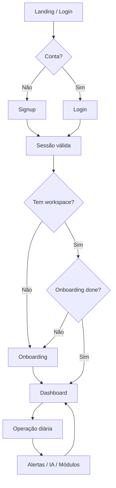

---

## 5. F01 — Autenticação

### F01.1 Signup

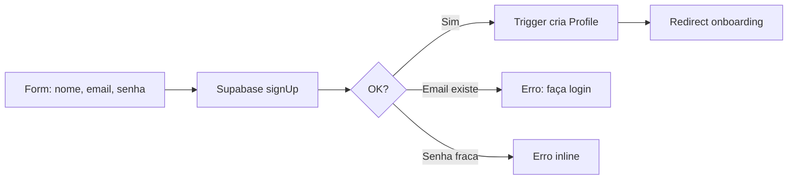

| Edge case | Comportamento |
|-----------|----------------|
| Email já cadastrado | Mensagem + link login |
| Magic link | Fluxo alternativo sem senha |
| Sessão expira no form | Reauth; draft em sessionStorage |

### F01.2 Login

Email/senha → middleware → destino: onboarding (se incompleto) ou dashboard.

### F01.3 Aceitar convite

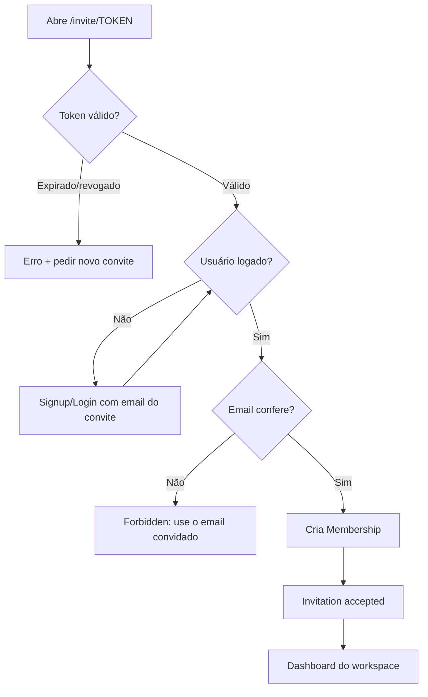

---

## 6. F02 — Onboarding

**Meta:** < 3 minutos até KPIs reais.

| # | Step | Dados | Obrigatório |
|---|------|-------|-------------|
| 1 | Boas-vindas | — | — |
| 2 | Nomes | partners + wedding.name | sim |
| 3 | Data | wedding_date | sim |
| 4 | Orçamento | total_budget | sim |
| 5 | Local | city; venue opcional | city recomendado |
| 6 | Estilo | style_tags | não |
| 7 | Convidar parceiro | email | não |
| 8 | Gerando plano | seed transaction | auto |
| 9 | Primeiros 3 passos | CTAs | — |

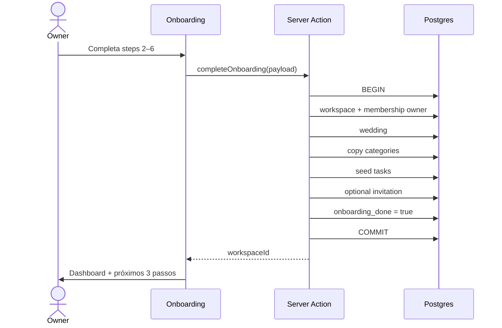

### Próximos 3 passos (regras, não IA)

1. Ajustar 3 maiores linhas (venue, catering, photo)  
2. Confirmar/adicionar fornecedor do local  
3. Revisar tarefas da fase atual  

| Edge case | Comportamento |
|-----------|----------------|
| Abandona no meio | `drafting` + `onboarding_done=false`; retoma step |
| Data no passado | Bloqueia; “já casamos” só via settings |
| Orçamento = 0 | Bloqueia |
| Seed falha | Rollback + retry |
| Já tem workspace | Não duplica |

---

## 7. F03 — Loop diário

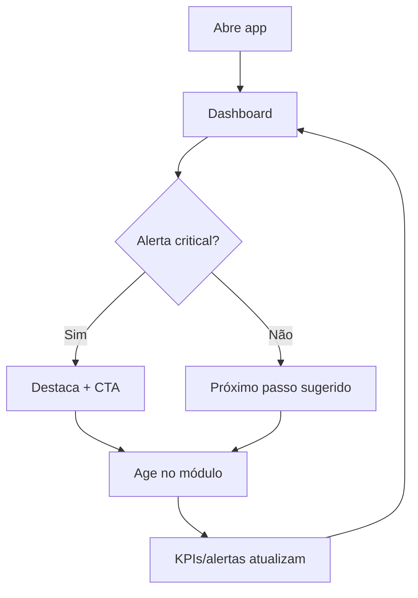

### Prioridade do “próximo passo”

1. Pagamento overdue (A4)  
2. Tarefa priority ≥ 4 atrasada (A5)  
3. Essencial sem fornecedor ≤ 90 dias (A6)  
4. Decisão pending com prazo  
5. Tarefa da fase atual sem responsável  
6. Orçamento estourado → Sala de cortes  

---

## 8. Fluxos por módulo

### F10 — Dashboard

| Gatilho | Resultado |
|---------|-----------|
| Load | KPIs + alertas + timeline 14d + decisões |
| Click alerta | Deep link com filtro |
| Over budget | CTA Sala de cortes |
| Drafting | Resume onboarding |

**Mobile:** KPIs em carrossel; menos charts.

---

### F11 — Orçamento

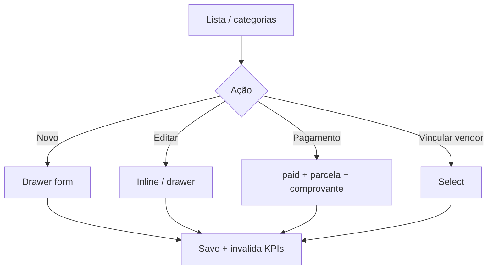

**Create mínimo:** category, description, planned_amount, priority, flexibility, emotional_return.

**Feedback pós-save:** “Previsto atualizado · Comprometido R$ X · Restante R$ Y”.

**Empty:** “Comece pelo local e buffet — costumam ser 50%+” + CTA.

| Edge | Comportamento |
|------|----------------|
| paid > contracted | Warning; permite ajuste |
| Soft delete | Confirm; KPIs recalculam |
| Collaborator edita | Forbidden |

---

### F12 — Sala de cortes (matriz)

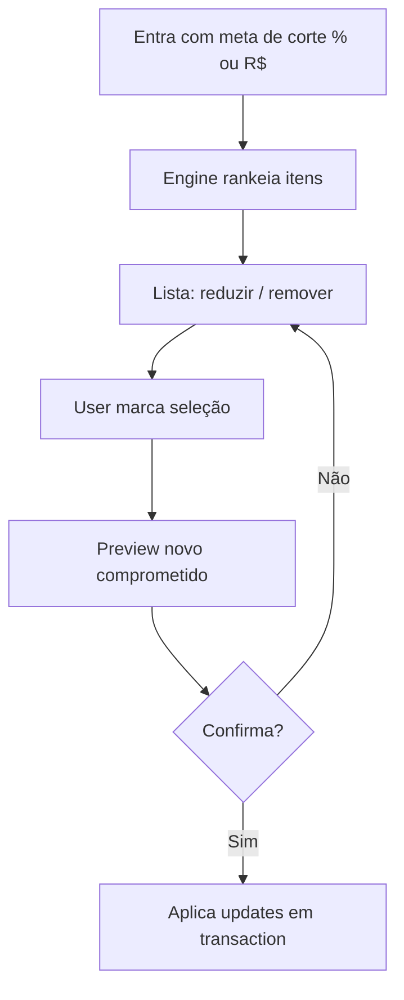

**Ranking:** `can_remove` / `can_reduce` primeiro; baixo `emotional_return`; alto custo; baixa priority.

Itens `cannot_cut` nunca entram na lista sugerida (só informativo).

---

### F13 — Checklist / Tarefas

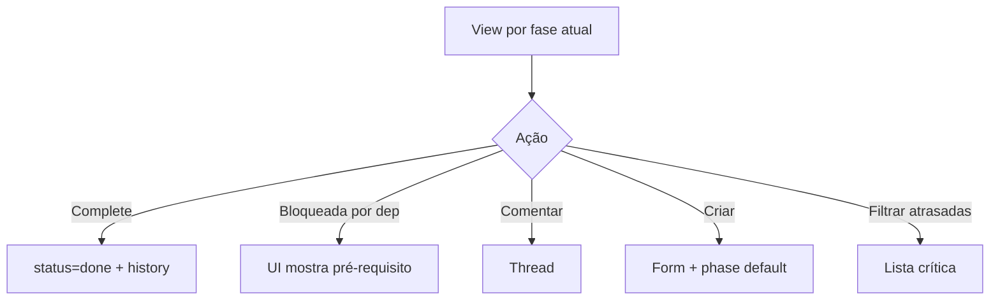

**Empty pós-seed:** não deve ocorrer; se seed vazio → CTA “Gerar tarefas com IA”.

| Edge | Comportamento |
|------|----------------|
| Complete com deps abertas | Confirm “mesmo assim?” |
| Collaborator em tarefa de outro | Só leitura / comentário se policy permitir |
| Mudança de wedding_date | Recalcula due_dates de tasks com `template_key` |

---

### F14 — Cronograma

Mesmas tasks; troca só a view:

| View | Interação principal |
|------|---------------------|
| Kanban | Drag status |
| Calendário | Click dia → tasks |
| Timeline | Barras start/due |

Drag Kanban = update status (mesmas regras de permissão).

---

### F15 — Fornecedores

**Happy path:** researching → contacted → quoted → contracted → (liga budget item).

**Empty:** “Contrate o local primeiro” se category venue vazia.

Ao marcar `contracted`: sugere criar/atualizar `BudgetItem` e `Decision`.

---

### F16 — Convidados

Filtros: grupo, RSVP, restrição, mesa, lado.

**KPIs locais:** total heads (`sum party_size`), confirmados, pendentes, com dietary.

| Edge | Comportamento |
|------|----------------|
| party_size < 1 | Bloqueia |
| Import CSV (MVP?) | Fora; manual + bulk add futuro |
| RSVP > 50% pending ≤ 30d | Alerta A8 |

---

### F17 — Presentes

Fluxo: available → reserved/purchased → delivered → thank_you_sent.

Vínculo opcional a `guest_id`.

---

### F18 — Lua de mel

Cards por tipo (flight, hotel, insurance, itinerary) + tasks `phase=honeymoon` + docs linked.

Custo pode espelhar budget category `honeymoon`.

---

### F19 — Documentos

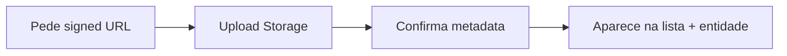

| Edge | Comportamento |
|------|----------------|
| MIME inválido | Erro antes do upload |
| > 10 MB | Bloqueia |
| Quota 1 GB | Bloqueia + mensagem |
| Delete | Soft delete DB; purge depois |

---

### F20 — Decisões

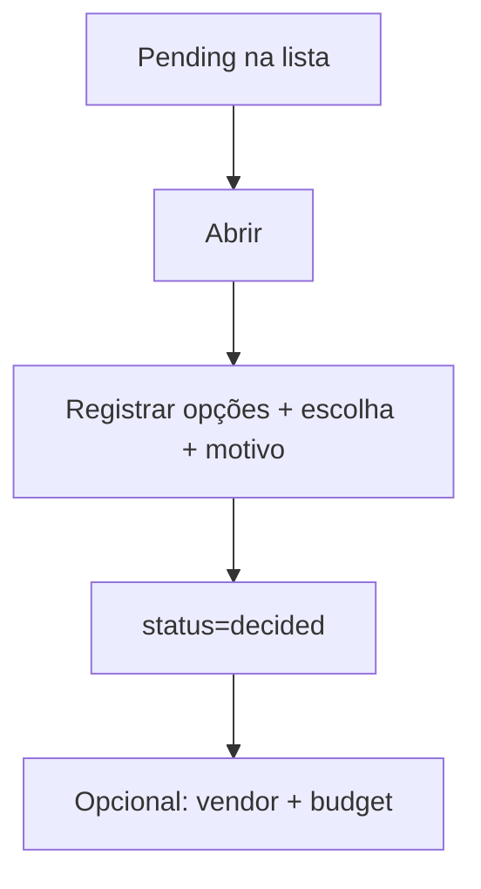

Dashboard mostra pending ordenadas por `due_date`.

---

### F21 — Analytics

Read-only. Entrada a partir do dashboard ou nav. CTAs para módulo de origem do insight (ex.: “Ver itens atrasados” → tasks filtradas).

---

### F22 — Alertas

Lista A1–A8 com severidade, entidade, CTA.

Dismiss no MVP = “adiar 7 dias” (local/prefs), não apaga a causa.

---

### F23 — Assistente de IA

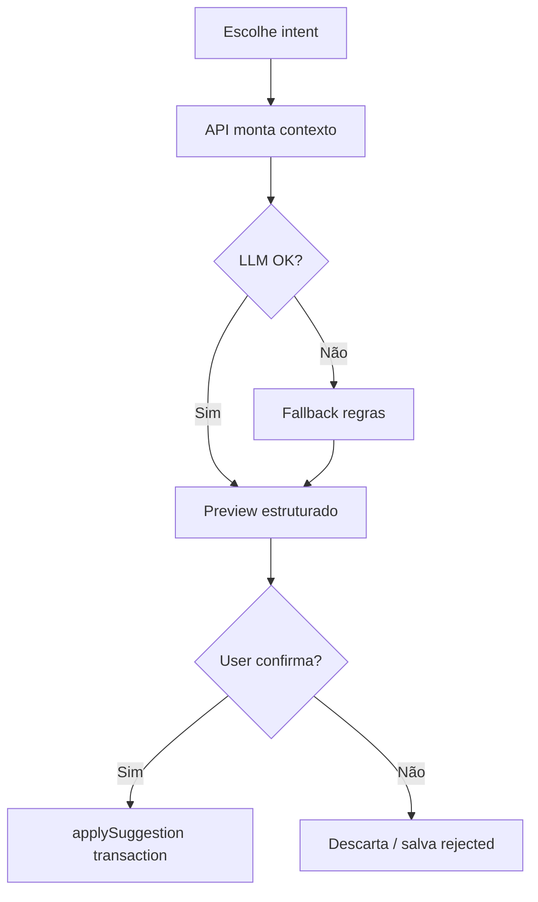

Nunca grava sem confirmação. Collaborator/viewer: Forbidden.

---

### F24 — Settings / Equipe

- Editar wedding (data, teto, estilo)  
- Membros e convites  
- Export dados (owner)  
- Delete account / workspace (owner, confirm 2 steps)  

Mudança de data → confirma “recalcular prazos do checklist?”.

---

## 9. Fluxos transversais

### T01 — Deep link de alerta

`/alerts` ou notificação → `/budget?highlight=id` (ou tasks/vendors).

### T02 — Entidades conectadas

Ao contratar vendor: oferta de criar Decision + atualizar BudgetItem (checklist de 1 tela).

### T03 — Forbidden

Qualquer mutação sem role → toast + não navega para form vazio.

### T04 — Offline / erro rede

Mutação falha → toast “Não salvamos. Tente de novo.” + mantém form preenchido.

### T05 — LGPD export/delete

Owner solicita export → JSON async (MVP sync se pequeno).  
Delete: digitar nome do workspace → soft delete → purge job.

---

## 10. Empty states por módulo (copy-guia)

| Módulo | Mensagem | CTA |
|--------|----------|-----|
| Orçamento | “Seu dinheiro precisa de um mapa.” | Adicionar primeiro item |
| Fornecedores | “Ainda sem contratos.” | Adicionar fornecedor |
| Convidados | “Quem vai celebrar com vocês?” | Adicionar convidado |
| Presentes | “Monte a lista com calma.” | Adicionar presente |
| Decisões | “Escolhas importantes merecem registro.” | Nova decisão |
| Documentos | “Contratos e comprovantes num só lugar.” | Enviar arquivo |
| IA | “Pergunte sobre cortes, contratações ou tarefas.” | Escolher intent |

---

## 11. Momentos de orientação (UX norteadora)

| Tela | Sempre visível |
|------|----------------|
| Shell | Dias restantes · % concluído · badge alertas |
| Page header | Título + 1 frase de próximo passo |
| Orçamento | Comprometido vs teto |
| Task | Fase atual destacada |
| Decisão pending | “Isso bloqueia X?” se linked |

---

## 12. Critérios de aceite — Fluxos

- [x] Auth, convite e onboarding especificados  
- [x] Loop diário e prioridade de próximo passo  
- [x] Fluxo por módulo do MVP  
- [x] Matriz de permissões  
- [x] Empty / error / forbidden / edge cases  
- [x] IA com confirmação humana  

---

## 13. Próxima etapa

**Etapa 5 — Sitemap**

Rotas App Router, grupos `(auth)/(onboarding)/(app)`, deep links e hierarquia de navegação.

**Não iniciaremos wireframes, Design System nem implementação até o sitemap ser revisado.**

---

### Changelog

| Versão | Data | Mudança |
|--------|------|---------|
| 1.0 | 2026-08-06 | Fluxos de usuário iniciais |
