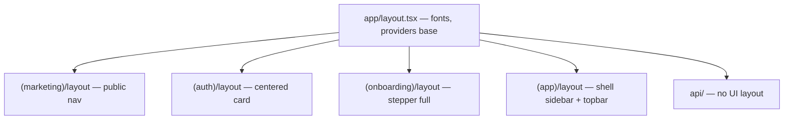
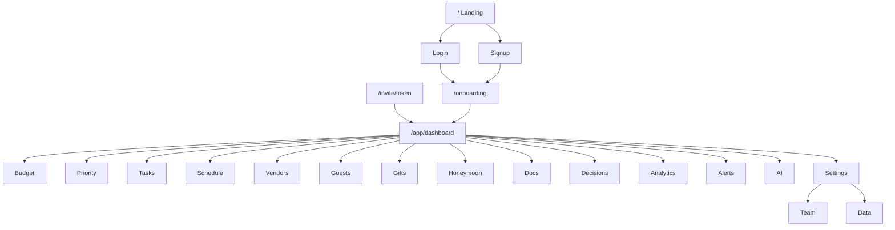

# Wedding Planner — Sitemap & Information Architecture

**Versão:** 1.0  
**Status:** Aprovado — wireframes em andamento  
**Data:** 06 de agosto de 2026  
**Base:** [PRD](./01-PRD.md) · [Arquitetura](./02-ARCHITECTURE.md) · [Fluxos](./04-USER-FLOWS.md)  

---

## 1. Decisões de IA (informação)

| ID | Decisão | Motivo |
|----|---------|--------|
| IA-01 | App Router com route groups | Layouts distintos sem poluir URL |
| IA-02 | Workspace implícito na sessão | MVP = 1 workspace ativo; URL limpa |
| IA-03 | Query params para filtros/deep links | Shareable sem rotas explosivas |
| IA-04 | Drawers/modais = estado de UI, não rota | Exceto detalhe “pesado” (opcional `?id=`) |
| IA-05 | `/` marketing; app em `/app/*` | Separa aquisição de produto |
| IA-06 | PT-BR nos labels; paths em inglês | Código/padrão Next; UI em português |

**Workspace na URL (futuro agency):** `/w/[workspaceSlug]/app/...` — não no MVP; sessão resolve o workspace.

---

## 2. Mapa visual

```text
/
├── (marketing)
│   ├── /                     Landing
│   ├── /pricing              (stub MVP)
│   └── /privacy · /terms
│
├── (auth)
│   ├── /login
│   ├── /signup
│   ├── /forgot-password
│   └── /invite/[token]
│
├── (onboarding)              auth required
│   └── /onboarding           multi-step
│
├── (app)                     auth + onboarding_done
│   └── /app
│       ├── /app                          → redirect /app/dashboard
│       ├── /app/dashboard
│       ├── /app/budget
│       ├── /app/priority                 Sala de cortes
│       ├── /app/tasks
│       ├── /app/schedule
│       ├── /app/vendors
│       ├── /app/guests
│       ├── /app/gifts
│       ├── /app/honeymoon
│       ├── /app/documents
│       ├── /app/decisions
│       ├── /app/analytics
│       ├── /app/alerts
│       ├── /app/ai
│       └── /app/settings
│           ├── /app/settings             geral (wedding)
│           ├── /app/settings/team
│           └── /app/settings/data        export / delete
│
└── api/
    ├── /api/health
    ├── /api/ai/assist
    └── /api/storage/upload-url
```

---

## 3. Route groups & layouts



| Group | Auth | Guard |
|-------|------|-------|
| `(marketing)` | público | Se logado + onboarding done → CTA “Abrir app” |
| `(auth)` | público | Se já logado → redirect inteligente |
| `(onboarding)` | obrigatório | Sem workspace ou `!onboarding_done` |
| `(app)` | obrigatório | `onboarding_done`; senão → `/onboarding` |

### Middleware redirects

```text
unauthenticated + /app/*        → /login?next=...
unauthenticated + /onboarding   → /login?next=/onboarding
authenticated + /login|/signup  → /app/dashboard ou /onboarding
authenticated + !done + /app/*  → /onboarding
authenticated + done + /onboarding → /app/dashboard
```

---

## 4. Catálogo de rotas

### 4.1 Marketing

| Path | Nome | Objetivo |
|------|------|----------|
| `/` | Landing | Aquisição; hero marca + CTA signup |
| `/pricing` | Preços | Stub “em breve” / waitlist |
| `/privacy` | Privacidade | LGPD |
| `/terms` | Termos | Uso |

### 4.2 Auth

| Path | Nome | Notas |
|------|------|-------|
| `/login` | Entrar | `?next=` |
| `/signup` | Criar conta | |
| `/forgot-password` | Recuperar senha | |
| `/invite/[token]` | Aceitar convite | Ver fluxo F01.3 |

### 4.3 Onboarding

| Path | Nome | Notas |
|------|------|-------|
| `/onboarding` | Setup inicial | Steps via state ou `?step=1..9` |

### 4.4 App — núcleo

| Path | Label nav | Módulo |
|------|-----------|--------|
| `/app/dashboard` | Início | Dashboard |
| `/app/budget` | Orçamento | Budget |
| `/app/priority` | Prioridades | Sala de cortes |
| `/app/tasks` | Tarefas | Checklist |
| `/app/schedule` | Cronograma | Kanban/Cal/Timeline |
| `/app/vendors` | Fornecedores | Vendors |
| `/app/guests` | Convidados | Guests |
| `/app/gifts` | Presentes | Gifts |
| `/app/honeymoon` | Lua de mel | Honeymoon |
| `/app/documents` | Documentos | Docs |
| `/app/decisions` | Decisões | Decisions |
| `/app/analytics` | Analytics | Analytics |
| `/app/alerts` | Alertas | Alerts |
| `/app/ai` | Assistente | IA |
| `/app/settings` | Configurações | Settings |

`/app` → redirect permanente para `/app/dashboard`.

### 4.5 Settings (sub-rotas)

| Path | Conteúdo |
|------|----------|
| `/app/settings` | Nome, data, orçamento teto, cidade, estilo |
| `/app/settings/team` | Membros, convites, roles |
| `/app/settings/data` | Export, delete workspace/account |

### 4.6 API

| Path | Método | Uso |
|------|--------|-----|
| `/api/health` | GET | Ping DB |
| `/api/ai/assist` | POST | Intent + context → suggestion |
| `/api/storage/upload-url` | POST | Signed upload |

Mutações de domínio = Server Actions (sem REST CRUD no MVP).

---

## 5. Query params & deep links

### 5.1 Padrão

| Param | Uso | Exemplo |
|-------|-----|---------|
| `id` | Destacar / abrir drawer do registro | `?id=uuid` |
| `view` | Sub-visualização | `?view=kanban` |
| `phase` | Filtro fase tarefas | `?phase=m3` |
| `status` | Filtro status | `?status=overdue` |
| `category` | Filtro categoria | `?category=venue` |
| `q` | Busca texto | `?q=buffet` |
| `highlight` | Scroll + pulse (alerta) | `?highlight=uuid` |
| `intent` | Pré-seleciona IA | `?intent=budget_overflow` |
| `step` | Onboarding | `?step=4` |
| `next` | Post-login redirect | `?next=/app/budget` |

### 5.2 Deep links por alerta

| Alerta | Destino |
|--------|---------|
| A1 / A2 over budget | `/app/priority` ou `/app/budget` |
| A3 / A4 pagamento | `/app/budget?status=payment_due&highlight=` |
| A5 tarefa atrasada | `/app/tasks?status=overdue&highlight=` |
| A6 sem vendor | `/app/vendors?category=&highlight=` |
| A7 decisão | `/app/decisions?status=pending&highlight=` |
| A8 RSVP | `/app/guests?status=rsvp_pending` |

### 5.3 Views do cronograma

| URL | View |
|-----|------|
| `/app/schedule?view=kanban` | Kanban (default) |
| `/app/schedule?view=calendar` | Calendário |
| `/app/schedule?view=timeline` | Timeline / Gantt leve |

### 5.4 Orçamento

| URL | View |
|-----|------|
| `/app/budget` | Tabela |
| `/app/budget?view=categories` | Agrupado |
| `/app/budget?view=charts` | Gráficos |

---

## 6. Navegação (shell)

### 6.1 Desktop — sidebar

Ordem fixa (agrupada):

```text
OPERAÇÃO
  Início
  Alertas          (badge count)
  Assistente

PLANEJAR
  Tarefas
  Cronograma
  Decisões

DINHEIRO
  Orçamento
  Prioridades
  Analytics

PESSOAS & FORNECEDORES
  Fornecedores
  Convidados
  Presentes

EXTRA
  Lua de mel
  Documentos

────────────
  Configurações
```

### 6.2 Topbar (global)

| Elemento | Conteúdo |
|----------|----------|
| Esquerda | Nome do casamento |
| Centro/direita | Dias restantes · % concluído · comprometido/teto |
| Direita | Alertas icon · AI shortcut · Avatar menu |

Avatar menu: settings, team, export, logout.

### 6.3 Mobile — bottom nav (5 itens)

| Tab | Rota |
|-----|------|
| Início | `/app/dashboard` |
| Tarefas | `/app/tasks` |
| Orçamento | `/app/budget` |
| Alertas | `/app/alerts` |
| Mais | Sheet com restante do menu |

### 6.4 Itens fora da nav primária

Acessíveis via Mais / dashboard / deep link: gifts, honeymoon, documents, analytics, priority, ai, schedule, decisions, vendors, guests.

**Decisão:** vendors e guests ficam na sidebar desktop; no mobile entram em “Mais” (exceto se badge crítico).

---

## 7. Hierarquia de páginas (sitemap formal)



---

## 8. Títulos de documento (browser)

| Rota | `document.title` |
|------|------------------|
| `/app/dashboard` | Início · Wedding Planner |
| `/app/budget` | Orçamento · Wedding Planner |
| `/app/priority` | Prioridades · Wedding Planner |
| `/app/tasks` | Tarefas · Wedding Planner |
| `/app/schedule` | Cronograma · Wedding Planner |
| `/app/vendors` | Fornecedores · Wedding Planner |
| `/app/guests` | Convidados · Wedding Planner |
| `/app/gifts` | Presentes · Wedding Planner |
| `/app/honeymoon` | Lua de mel · Wedding Planner |
| `/app/documents` | Documentos · Wedding Planner |
| `/app/decisions` | Decisões · Wedding Planner |
| `/app/analytics` | Analytics · Wedding Planner |
| `/app/alerts` | Alertas · Wedding Planner |
| `/app/ai` | Assistente · Wedding Planner |
| `/app/settings` | Configurações · Wedding Planner |

Padrão: `{Página} · {Wedding.name} · Wedding Planner` quando nome disponível.

---

## 9. Estados de rota especiais

| Situação | Resposta |
|----------|----------|
| 404 app | Página “Não encontramos” + CTA dashboard |
| Forbidden action | Permanece na rota; toast |
| Convite inválido | `/invite/[token]` com estado erro (não redirect silencioso) |
| Health fail | `/api/health` → 503 |

Não há rotas `/app/[entity]/[id]` no MVP — detalhe via `?id=` + drawer para velocidade.

**Exceção futura:** `/app/vendors/[id]` se a ficha ficar muito rica.

---

## 10. Mapa fluxo → rota

| Fluxo | Rota(s) |
|-------|---------|
| F01 Auth | `/login`, `/signup`, `/invite/[token]` |
| F02 Onboarding | `/onboarding` |
| F03 Loop diário | `/app/dashboard` |
| F10 Dashboard | `/app/dashboard` |
| F11 Orçamento | `/app/budget` |
| F12 Sala de cortes | `/app/priority` |
| F13 Checklist | `/app/tasks` |
| F14 Cronograma | `/app/schedule` |
| F15 Fornecedores | `/app/vendors` |
| F16 Convidados | `/app/guests` |
| F17 Presentes | `/app/gifts` |
| F18 Lua de mel | `/app/honeymoon` |
| F19 Documentos | `/app/documents` |
| F20 Decisões | `/app/decisions` |
| F21 Analytics | `/app/analytics` |
| F22 Alertas | `/app/alerts` |
| F23 IA | `/app/ai` |
| F24 Settings | `/app/settings/*` |

---

## 11. Estrutura de pastas `app/` (alvo)

```text
app/
├── layout.tsx
├── not-found.tsx
├── (marketing)/
│   ├── layout.tsx
│   ├── page.tsx                 → /
│   ├── pricing/page.tsx
│   ├── privacy/page.tsx
│   └── terms/page.tsx
├── (auth)/
│   ├── layout.tsx
│   ├── login/page.tsx
│   ├── signup/page.tsx
│   ├── forgot-password/page.tsx
│   └── invite/[token]/page.tsx
├── (onboarding)/
│   ├── layout.tsx
│   └── onboarding/page.tsx
├── (app)/
│   ├── layout.tsx               → AppShell
│   └── app/
│       ├── page.tsx             → redirect dashboard
│       ├── dashboard/page.tsx
│       ├── budget/page.tsx
│       ├── priority/page.tsx
│       ├── tasks/page.tsx
│       ├── schedule/page.tsx
│       ├── vendors/page.tsx
│       ├── guests/page.tsx
│       ├── gifts/page.tsx
│       ├── honeymoon/page.tsx
│       ├── documents/page.tsx
│       ├── decisions/page.tsx
│       ├── analytics/page.tsx
│       ├── alerts/page.tsx
│       ├── ai/page.tsx
│       └── settings/
│           ├── page.tsx
│           ├── team/page.tsx
│           └── data/page.tsx
└── api/
    ├── health/route.ts
    ├── ai/assist/route.ts
    └── storage/upload-url/route.ts
```

---

## 12. Critérios de aceite — Sitemap

- [x] Rotas cobrem todos os módulos do MVP  
- [x] Guards auth/onboarding definidos  
- [x] Nav desktop + mobile  
- [x] Deep links de alertas  
- [x] Query params padronizados  
- [x] API mínima listada  
- [x] Mapa fluxo → rota  

---

## 13. Próxima etapa

**Etapa 6 — Wireframes**

Wireframes de baixa/média fidelidade das telas-chave (shell, dashboard, orçamento, tarefas, onboarding), alinhados a este sitemap e aos fluxos.

**Não iniciaremos Design System nem implementação até os wireframes serem revisados.**

---

### Changelog

| Versão | Data | Mudança |
|--------|------|---------|
| 1.0 | 2026-08-06 | Sitemap e IA de navegação iniciais |
